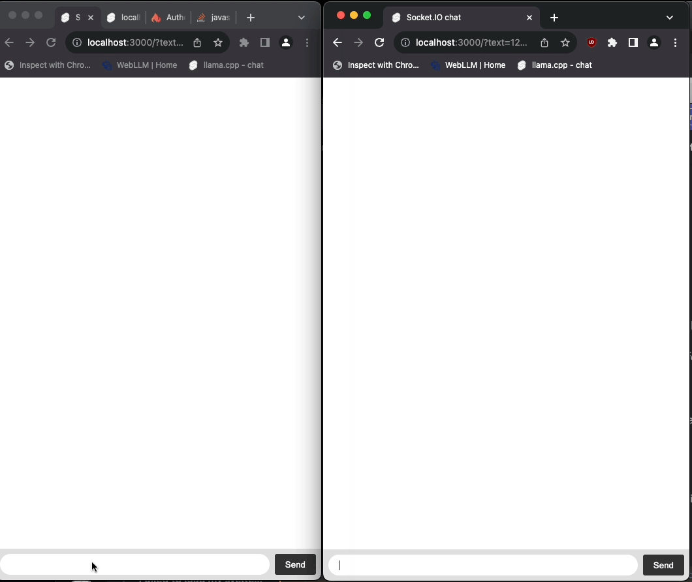

## MiniPin

> Note: This repo is in a very early stage!

A partial reimplementation of the [GRIP protocol](https://pushpin.org/docs/protocols/grip/) that Pushpin uses, trading complexity for a "happy path" approach that should fit most use cases in a fraction of the code and memory usage of Pushpin.

Implemented as a single Node.js application.

### Start locally

```
nvm use
npm i
npm run dev
```

Default `path_beg` configuration is `/api/pushpin` on `http://localhost:5173`. Configurable via `process.env.PUSHPIN_PREFIX` / `process.env.ORIGIN_SERVER_URL`.

Proxy: http://localhost:3000

HTTP control API: http://localhost:3001

Only `/publish` endpoint with SSE is implemented on the Control API.

### Demo

There is an included chat demo. First start the MiniPin server as mentioned above, then start the demo with:

```
cd demo
npm i
npm run dev
```

Go to:
http://localhost:5173/

Preview



### Goals

- [x] Support the Server Sent Events transport
- [x] Support `Grip-Channel`
- [ ] Support `Grip-Keep-Alive`
- [ ] Support `Grip-Sig`
- [ ] Work with existing Pushpin libraries
- [ ] Support medium traffic levels (eg. thousands of concurrent users)
- [ ] Support paged streaming, Sequence IDs and Reliability features
- [x] Written as single Node.js application

### Non-goals

* Supporting large amounts of users (eg. 50 000 concurrent users)
* Supporting more than one running instance of MiniPin (ie. clustering)
* Supporting WebSocket